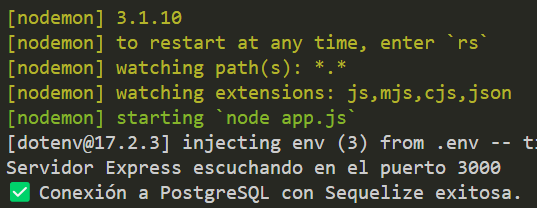

# 🛠️ Proyecto de Gestión de Activos

Este proyecto es una aplicación web completa diseñada para la gestión de **usuarios** y **activos (assets)**.

---

## 🔑 Funcionalidades Principales

* **Autenticación de Usuarios:** Permite la **creación** y el **inicio de sesión (logeo)** de usuarios.
* **CRUD de Activos (Assets):** Ofrece las operaciones básicas de **Crear (Create)**, **Leer (Read)**, **Actualizar (Update)** y **Eliminar (Delete)** para la gestión de los activos del sistema.

---

## 💻 Tecnologías Utilizadas

| Componente | Tecnología |
| :--- | :--- |
| **Frontend** | **React** con **Vite** |
| **Backend API** | **Express** (sobre **Node.js**) |
| **Base de Datos** | **PostgreSQL** |

---

## 🚀 Puesta en Marcha (Local)

El proyecto está configurado para un despliegue local rápido utilizando **Docker** y **Docker Compose**.

1.  **Levantar la aplicación:** Ejecuta el siguiente comando en la terminal desde la raíz del proyecto:
    ```bash
    docker-compose up -d
    ```

2.  **Verificar la conexión de la API:** Es crucial asegurar que el contenedor del *backend* (API) se haya conectado correctamente a la base de datos.
    * **Comprueba los logs:** Una vez levantados los contenedores, revisa los logs del contenedor de la API con:
        ```bash
        docker logs [id_contenedor_api]
        ```
        (Reemplaza `[id_contenedor_api]` con el ID o nombre real del contenedor de la API).

3.  **Solución de Problemas:** Si observas problemas de conexión o errores en los logs:
    * **Reiniciar contenedor:** reinicia el contenedor de la api backend:
        ```bash
        docker restart [id_contenedor_api]
        ```
        Sabras que el contenedor se levanto correctamente si en la consola vez lo siguiente:
    
        

    * **Baja los contenedores:** Si el error persiste, elimina los contenedores y redes creadas por Compose:
        ```bash
        docker-compose down
        ```
    * **Vuelve a levantar:** Repite el paso 1 para un nuevo intento:
        ```bash
        docker-compose up -d
        ```
4.  **Acceder al Login:** Si los contenedores se levantaron de forma correcta, podras acceder al [login](http://localhost:5173/login).
